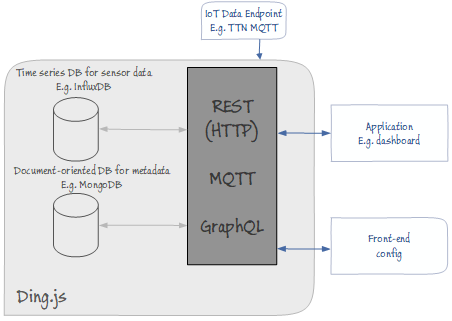

# Ding.js

Ding.js is an Internet of Things service API. It is a framework to gather IoT data, from various endpoints and provide REST and MQTT  API's to build an application with. The framework is configured in JSON to dynamically compose the API's.

In Ding.js, IoT endpoints provide data which is gathered in a time series database. This data is complemented with metadata.

Ding.js is a work in progress [View on Gitlab](https://gitlab.com/devbit/dingjs)

## Configuration

* [Ding.js configuration](./configuration.md)

## Inputs

Ding.js supports different kind of input sources. Each source is definded as an 'input'. Here you will find a list of the currently supported input types:

* [The Things Network](./inputs/ttn.md)

## Outputs

Out of the box, Ding.js will provide different endpoints to get your data from:

* HTTP REST
* MQTT
* GraphQL

* [REST API](./outputs/rest.md)

## Storage

### Data 

### Metadata
